```{r setup, include=FALSE}
knitr::opts_chunk$set(echo = TRUE)
```

```{r echo=FALSE, out.width = "30%", fig.align = "center"}
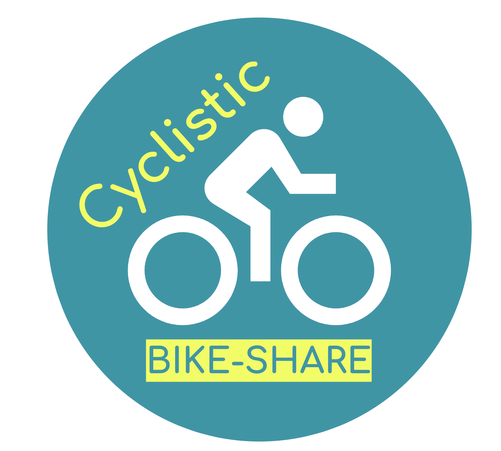
```

# Introduction

This case study is the capstone of the Google Data Analytics
Professional Certificate. In this case study, we work for a fictional
company.

We are acting as a junior data analyst working on the marketing analyst
team at Cyclistic, a bike-share company in Chicago. The director of
marketing believes the company’s future success depends on maximizing
the number of annual memberships. Therefore, our team wants to
understand how casual riders and annual members use Cyclistic bikes
differently.

From these insights, our team will design a new marketing strategy to
convert casual riders into annual members. But first, Cyclistic
executives must approve our recommendations, so they must be backed up
with compelling data insights and professional data visualizations.

In order to answer the business questions, the steps of the data
analysis process: Ask, Prepare, Process, Analyze, Share, and Act, will
be followed.

# Business Case

## The Cyclistic Company

In 2016, Cyclistic launched a successful bike-share offering. Since
then, the program has grown to a fleet of 5,824 bicycles that are
geotracked and locked into a network of 692 stations across Chicago. The
bikes can be unlocked from one station and returned to any other station
in the system anytime.\
It sets itself apart by also offering reclining bikes, hand tricycles,
and cargo bikes, making bike-share more inclusive to people with
disabilities and riders who can’t use a standard two-wheeled bike.

The pricing plan is based on flexibility: single-ride passes, full-day
passes, and annual memberships. Customers who purchase single-ride or
full-day passes are referred to as casual riders. Customers who purchase
annual memberships are Cyclistic members.

## Problematic

Cyclistic’s finance analysts have concluded that annual members are much
more profitable\
than casual riders. Although the pricing flexibility helps Cyclistic
attract more customers, maximizing the number of annual members would be
key to future growth.

Rather than creating a marketing campaign that targets all-new
customers, there is a solid opportunity to convert casual riders into
members. Casual riders are already aware of the Cyclistic program and
have chosen Cyclistic for their mobility needs.

# Ask

The goal is to design marketing strategies aimed at converting casual
riders into annual members. In order to do that, however, the team needs
to better understand:

1.  How do annual members and casual riders use Cyclistic bikes
    differently?\
2.  Why would casual riders buy Cyclistic annual memberships?\
3.  How can Cyclistic use digital media to influence casual riders to
    become members?

The business task is to study the differences of usage between members
and casual riders. Based on these differences, we will identify how
members prefer to ride, and how casual riders use the services of
Cyclistic. In that way we can identify insights that would help
Cyclistic to encourage casual riders to become members.

We will have to analyze the Cyclistic historical bike trip data to
identify trends.

# Prepare

## Data location

The datasets are located on an Amazon server. The datasets have a
different name because Cyclisticis a fictional company. The data has
been made available by Divvy, a program of the Chicago Department of
Transportation, which owns the city’s bikes, stations and vehicles,
under license.

## Source

This is public data that we are going to use to explore how different
customer types are using Cyclistic bikes. The data can be considered as
credible.

## Good data?

Data is ROCCC compliant as it is:

-   **R**eliable: data represents the usage of all stations for all
    users, members or casual, with no bias.\
-   **O**riginal: The data comes from a direct source, not from an
    intermediate or a tier source.\
-   **C**omprehensive:The datasets are comprehensive and all information
    we need.\
-   **C**urrent: The datasets are up to date and relevant. Data is
    refreshed each month.\
-   **C**ited: The data are cited. The source is known and reliable.

## Data organization

The datasets are split by months, in a zip format. It is required to
download the last 12 previous months. The case study started in June
2024.

```{r echo=FALSE, out.width = "30%", fig.align = "center"}
knitr::include_graphics("images/image15.png")
```

## Datasets structure

Each dataset contains a CSV file displaying data by ride from a start
station to an end station:

| Column | Description | Example |
|:-----------------------|:-----------------------|:-----------------------|
| ride_id | Identification of the ride. | *6F1682AC40EB6F71* |
| rideable_type | 3 different types of bike used (electric, docked, classic). | *electric_bike* |
| started_at | Date and time of the ride start (format : yyyy-mm-dd h24:mn:ss). | *2023-06-05 13:34:12* |
| ended_at | Date and time of the ride end (format : yyyy-mm-dd h24:mn:ss). | *2023-06-05 14:31:56* |
| start_station_name | Name of the start station. | *2112 W Peterson Ave* |
| start_station_id | Identification of the start station. | *KA1504000155* |
| end_station_name | Name of the end station. | *Clark St & Bryn Mawr Ave* |
| end_station_id | Identification of the end station. | *KA1504000151* |
| start_lat | Latitude of the start station. | *41.991220117* |
| start_lng | Longitude of the start station. | *41.9840446107* |
| end_lat | Latitude of the end station. | *41.983593* |
| end_lng | Longitude of the end station. | *-87.669154* |
| member_casual | Type of user: casual or member. | *member* |

## First Data integrity Check

A first data integrity for each file is performed with a spreadsheet
like Excel or Google Spreadsheet.

-   Some fields have no values for an entry; this is a case for
    start_station_name, start_station_id, end_station_name,
    end_station_id, end_lat, end_lng\
-   Some dates in a monthly file give information about the next month
    or the previous month. For example, a member takes a bike on August
    31st and gives it back on September 1st.\
-   Some end_lat and end_lng values equal 0\
-   Some ride_id have a different format (e.g. 1886432520245480 when
    other values are hexadecimal on 16 characters\
-   The format of start_station_id and end_station_id is not consistent
    (TA1309000033, 866, WL-011, …)

These remarks must be taken into account in the next steps and see if
actions are needed or not.

## Data credibility

These datasets are coming from a trusted source. They are ROCCC
compliant. We can use them in our study.\
In the next steps more in-depth integrity checks will be performed.

# Process

In this step, we use R as a tool to check, clean and transform data to
be ready for analysis. I would like to use SQL but I could not use Big
Queries with the large dataset that we have to work on.

## Read CSV files

I will use the tidyverse package:

```{r message=FALSE, warning=FALSE}
if(!require(tidyverse)){
install.packages("tidyverse",repos = "http://cran.us.r-project.org")
library(tidyverse) 
}
```

Then all the 12 CSV files are read

```{r warning=FALSE}
setwd("./datasets")
df2306 <- read.csv("202306-divvy-tripdata.csv")
df2307 <- read.csv("202307-divvy-tripdata.csv") 
df2308 <- read.csv("202308-divvy-tripdata.csv") 
df2309 <- read.csv("202309-divvy-tripdata.csv")
df2310 <- read.csv("202310-divvy-tripdata.csv")
df2311 <- read.csv("202311-divvy-tripdata.csv")
df2312 <- read.csv("202312-divvy-tripdata.csv")
df2401 <- read.csv("202401-divvy-tripdata.csv")
df2402 <- read.csv("202402-divvy-tripdata.csv")
df2403 <- read.csv("202403-divvy-tripdata.csv")
df2404 <- read.csv("202404-divvy-tripdata.csv")
df2405 <- read.csv("202405-divvy-tripdata.csv")
setwd("../")
```

All datasets are merged into one data frame dfRide.

```{r}
dfRide = rbind(df2306,df2307,df2308,df2309,df2310,df2311,df2312,df2401,df2402,df2403,df2404,df2405)
rm(df2306,df2307,df2308,df2309,df2310,df2311,df2312,df2401,df2402,df2403,df2404,df2405)
```

We check the dimension of the dataframe

```{r}
dim(dfRide)
```

5,743,278 rows for 13 columns. Let’s see the structure with str(dfRide)

```{r}
 str(dfRide)
```

## Looking for inconsistencies

We first check for duplicated rows.

```{r}
dfRide[duplicated(dfRide),]
```

There are no duplicated rows.

### ride_id

ride_id acts as the primary key of the dataset. Hopefully it is never
empty.

```{r}
dfRide %>% filter(is.na(rideable_type)) %>% count()
```

It is also unique.

```{r}
dfRide$ride_id[duplicated(dfRide$ride_id)]
```

### rideable_type

rideable_type is never empty.

```{r}
dfRide %>% filter(is.na(rideable_type)) %>% count()
```

It contains only 3 values.

```{r}
unique(dfRide$rideable_type)
```

49.27% of classic bikes, 0.86% of decked bikes, and 49.87% of electric
bikes.

```{r}
dfRide %>%
  group_by(rideable_type) %>% 
  count()
```

### started_at, ended_at

The fields are never empty.

```{r}
dfRide %>% 
  filter(is.na(started_at)) %>% 
  count()
```

```{r}
dfRide %>% 
  filter(is.na(ended_at)) %>% 
  count()
```

Some observations are impossible: case when the end is before the start.

### start_station_id, start_station_name, end_station_id, end_station_name

They are not null.

```{r}
dfRide %>% 
  filter(is.na(start_station_id)) %>% 
  count()
```

```{r}
dfRide %>% 
  filter(is.na(end_station_id)) %>% 
  count()
```

```{r}
dfRide %>% 
  filter(is.na(start_station_name)) %>% 
  count()
```

```{r}
dfRide %>% 
  filter(is.na(end_station_name)) %>% 
  count()
```

However, they can store an empty string.

```{r}
dfRide %>% 
  filter(str_length(start_station_id) == 0) %>% 
  count()
```

```{r}
dfRide %>% 
  filter(str_length(start_station_name) == 0) %>%
  count()
```

```{r}
dfRide %>% 
  filter(str_length(end_station_id) == 0) %>% 
  count()
```

```{r}
dfRide %>%
  filter(str_length(end_station_name) == 0) %>% 
  count()
```

Empty start station fields are due to electric bike usage mainly.

```{r}
dfRide %>%
  filter(str_length(start_station_name) == 0 | str_length(start_station_id) == 0) %>%                 group_by(rideable_type) %>% 
  count()
```

The same is happening for end station fields

```{r}
dfRide %>%
  filter(str_length(end_station_name) == 0 & str_length(end_station_id) == 0) %>%
  group_by(rideable_type) %>% 
  count()
```

When one of the start station fields is empty, the other one is empty
too.

```{r}
dfRide %>%
  filter(str_length(start_station_name) == 0 & str_length(start_station_id) != 0)
```

```{r}
dfRide %>%
  filter(str_length(start_station_name) != 0 & str_length(start_station_id) == 0)
```

We observe the same behaviour for end station fields.

```{r}
dfRide %>%
  filter(str_length(end_station_name) == 0 & str_length(end_station_id) != 0)
```

```{r}
dfRide %>%
  filter(str_length(end_station_name) != 0 & str_length(end_station_id) == 0)
```

The start station fields and the end station fields do not follow the
same logic. If one of the start station fields is empty, it does not
mean that the corresponding end station field will be empty too, and
vice versa.

```{r}
dfRide %>%
  filter(str_length(start_station_id) != 0 & str_length(end_station_id) == 0) %>%
  count() 
```

```{r}
dfRide %>%
   filter(str_length(start_station_id) == 0 & str_length(end_station_id) != 0) %>%
   count()
```

The next code section tests if a name of a start station is associated
with one and unique station id. We notice that several start station id
fields share different names. Some are different because of different
wording or orthography, but others are totally different.

```{r}
df1 <- dfRide %>%
  group_by(start_station_id, start_station_name) %>%
  summarise (n1 = n(), .groups = 'drop') 

df1 <- df1 %>%
  group_by(start_station_id) %>%
  summarise (n2 = n(), .groups = 'drop') %>%
  filter (n2 >1) 

dfRide %>%
  select (start_station_id, start_station_name) %>%
  filter (start_station_id %in% df1$start_station_id) %>%
  unique() %>%
  arrange(start_station_id, start_station_name)
```

154 observations for start station fields are in this case. The same
problem is happening with end station id and end station name fields for
157 observations.

### Start_lat, end_lat, start_lng, and end_lng

The fields and_lat and end_lng can be empty.

```{r}
dfRide %>% filter(is.na(start_lat)) %>% count() 
```

```{r}
dfRide %>% filter(is.na(end_lat)) %>% count()
```

```{r}
dfRide %>% filter(is.na(start_lng)) %>% count() 
```

```{r}
dfRide %>% filter(is.na(end_lng)) %>% count()
```

```{r}
dfRide %>% filter(is.na(end_lat) & is.na(end_lng)) %>% count()
```

They can be empty even if we have the information about the end station.

```{r}
dfRide %>%
  summarise (max_start_lat = max(start_lat),
  min_start_lat = min(start_lat),
  max_start_lng = max(start_lng),
  min_start_lng = min(start_lng),
  max_end_lat = max(end_lat),
  min_end_lat = min(end_lat),
  max_end_lng = max(end_lng),
  min_end_lng = min(end_lng)) 
```

### member_casual

The field is never empty and stores only 2 values for member or casual.

```{r}
dfRide %>% 
  filter(is.na(member_casual)) %>% count()
```

```{r}
unique(dfRide$member_casual)
```

I was wondering if each station has one latitude and longitude value. It
is not the case. Here is an example with the start station.

```{r message=FALSE, warning=FALSE}
dfRide %>% 
  filter (start_station_id != "") %>%
  select (start_station_id, start_lat) %>%
  group_by(start_station_id, as.character(start_lat)) %>%
  summarise (n1 = n())
```

## Transform

We transform started_at and ended_at into datetime type as they are
characters.

```{r}
dfRide <- mutate(dfRide, 
		started_at = as_datetime(dfRide$started_at),
		ended_at = as_datetime(dfRide$ended_at))
```

We compute the ride_length for the duration of the ride in seconds.

```{r}
dfRide <- mutate(dfRide, ride_length = dfRide$ended_at - dfRide$started_at )
```

We add day_of_the_week (Mon, Tue, …) and the ride_month (Jun, Jul, …)

```{r}
dfRide <- mutate(dfRide, day_of_week = wday(started_at, label = TRUE))
dfRide <- mutate(dfRide, ride_month = month(started_at, label = TRUE)) 
```

```{r}
head(dfRide)
```

## Cleaning

We start with 5,743,278 observations

### Removal of negative duration

441 observations have a negative duration (0.77%)

```{r}
dfRide <- dfRide %>% filter(ended_at >= started_at)
```

A lot of rides do not last more than 30 seconds. A minimum duration
should be considered as a realistic duration.

### Removal of unknown starting or unknown ending station

1428013 observations would be filtered out if both ending and starting
points are unknown, which represent 24.86% of observations. 994721
observations would be filtered out if we filter out if one of the ending
or starting points is unknown, which represents 17.32% of observations.
In both cases, that is a lot. In real life, we would go back to
stakeholders to understand the business rules that cause all the
inconsistencies.

### Removal of observations without any ending geographical location.

7684 observations will be filtered out if we remove observations with
any geographical locations, which represents 0.13%.

```{r}
dfRide <- dfRide %>% filter(!is.na(end_lat) & !is.na(end_lng))
```

We also remove 3 observations where end_lat and end_lng equals 0.

```{r}
dfRide <- dfRide %>% filter(end_lng != 0 & end_lat != 0)
```

# Analyze

## Calculation

A few calculations about ride_lenght are performed to get a better sense
of the data.

```{r}
Modes <- function(x) { 
	ux <- unique(x) 
	tab <- tabulate(match(x, ux))
	ux[tab == max(tab)] 
	}
dfRide %>% 
	summarise (mean_ride_length = mean(ride_length),
	max_ride_length = max(ride_length), 
	min_ride_length = min(ride_length),
	mode_week_day = Modes(day_of_week))

```

Regarding ride_length, a concern can be raised as the minimum is 0
second and the maximum is 669136 seconds ( equivalent to 7 days 17 hours
52 minutes and 16 seconds )

Let’s check the average ride_length for members and casual riders.

```{r}
dfRide %>% 
	group_by(member_casual ) %>% 
	summarise (mean_ride_length = mean(ride_length))
```

Casual users tend to ride longer than members which is very interesting
to learn.

Let’s check the average ride_length per day of the week.

```{r}
dfRide %>% 
	group_by(day_of_week) %>%
	summarise (mean_ride_length = mean(ride_length))
```

The rides are longer during the weekend, which is not surprising.

Let’s now check the number of rides for users by day_of_week.

```{r}
dfRide %>% count(day_of_week)
```

Surprisingly, many users cycle between Wednesday and Friday. Saturday is
the day with the most users and Sunday is the day with the fewest users.

## Output CSV file

After being merged, cleaned and transformed, the dataset will be shared
as a CSV file in the following analyses.

```{r message=FALSE, warning=FALSE}
write.csv(dfRide, "cyclistic-tripdata.csv")
```

The final CSV file will be used as an entry for the next analysis steps
with Tableau.

# Share

```{r include=FALSE}
colorize <- function(x, color) {
  if (knitr::is_latex_output()) {
    sprintf("\\{\\textcolor{%s}}{%s}", color, x)
  } else if (knitr::is_html_output()) {
    sprintf("<span class='Bold' style='font-weight:bold;color: %s;'>%s</span>", color,
      x)
  } else x
}
```

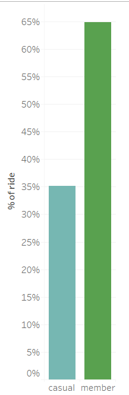 A majority of users are
`r colorize("members",'#59A14F')`(65 %). A small portion represents
`r colorize("casual",'#76B7B2')` users(35 %).

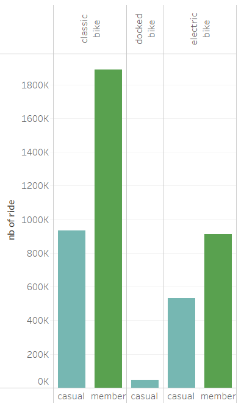 Docked bikes are never used, except a little bit
by `r colorize("casual",'#76B7B2')` users (4%), probably for the simple
pleasure of trying an original means of transport as part of a visit.\
The preference remains for classic bikes (71%) whatever the type of
user, compared to the electronic bikes (25%).

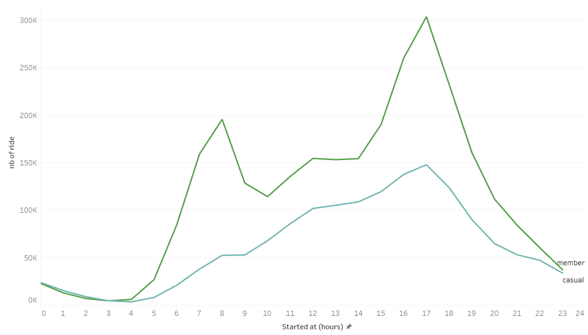\
We can see spikes in bike usage during peak hours for
`r colorize("members",'#59A14F')` users. Their use is linked to the
journey home to work (7h to 8h and 17h to 18h). As for
`r colorize("casual",'#76B7B2')` users, their number increases
continuously from hour to hour until reaching a peak around 17 h., at
the end of the day. The analysis was carried out on the start time of
the journey. However, a similar result is observed at the same time if
we look at the end time of the journey.

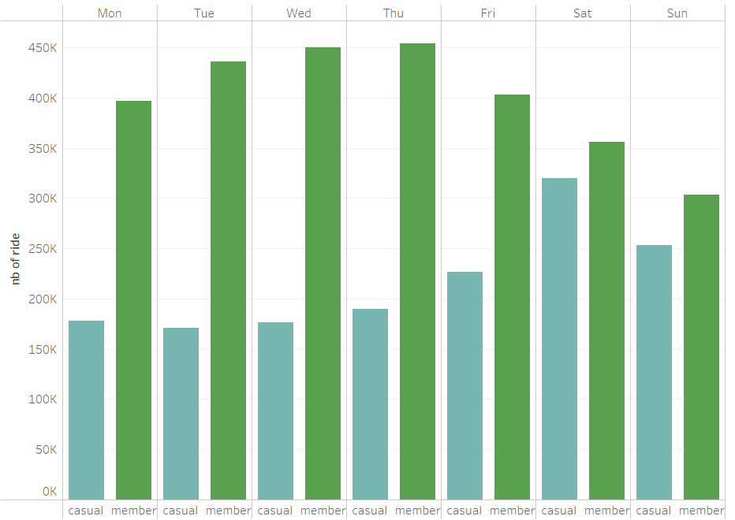\
`r colorize("Members",'#59A14F')` use the bikes during the week from
Monday to Friday with a peak on Thursday. Then it drops on the weekend.
Conversely, `r colorize("casual",'#76B7B2')` users use bicycles mainly
on weekends, with a peak on Saturdays.This seems to be stable during the
week. Friday is the day when trends start to reverse.

## When do they use it ?

In the last graph, we distinguish users by their use during a day or a
week and see that they use Cyclistic’s bikes for different usages.\
However, how is their behaviour for longer terms like year?

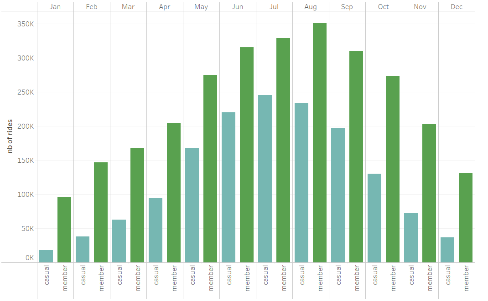\
Both types, `r colorize("members",'#59A14F')` or
`r colorize("casual",'#76B7B2')` riders, use bicycles during periods of
good weather, with no rain, warm and sunny, with a peak in August.
Conversely, they use bicycles very little during the cold or rainy
months, with the lowest level reached in January.

## How do they use it?

We start to get an idea of who Cyclistic's users are, how each type of
user uses the service and when. Now let's look at how and why each of
them use these bikes.

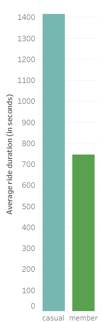 `r colorize("Members",'#59A14F')` use the bikes
the least amount of time on average. `r colorize("Casuals",'#76B7B2')`
spend more time on their bikes. `r colorize("Members",'#59A14F')`
probably have to use bikes to get from point A to point B when
commuting, `r colorize("casual",'#76B7B2')` people use them more for
leisure.

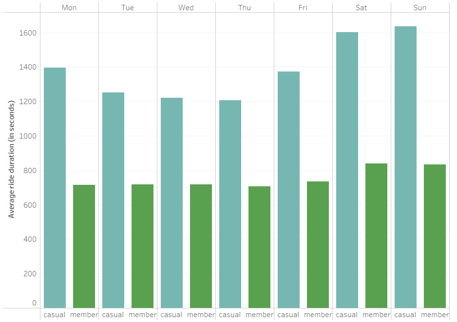 `r colorize("Member",'#59A14F')` users use the
bikes for the same amount of time on average over the entire week. They
use the bikes slightly longer during the weekend. However, we have seen
that fewer `r colorize("member",'#59A14F')` users use bikes at the end
of the week. This should be a small portion that needs to use the bikes
for longer periods of time over the weekend.\
`r colorize("Casual",'#76B7B2')` users, even if more in the minority
than `r colorize("members",'#59A14F')`, use the bikes longer, especially
on weekends.

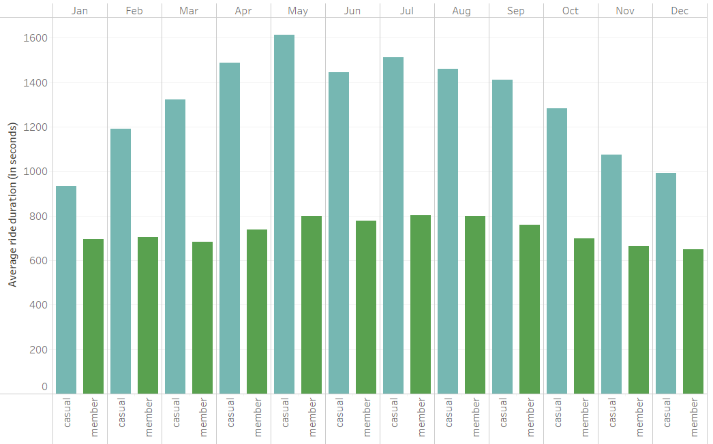\
The time `r colorize("members",'#59A14F')` use the bikes is fairly
constant over the course of a year, even if they use the bikes more in
summer than in winter.\
`r colorize("Casual",'#76B7B2')` users use the bikes longer on sunny
days. The peak of time used is reached in May, even if the number of
`r colorize("casual",'#76B7B2')` users is at its peak in August.

## What do they use?

As seen previously, `r colorize("classic bikes",'#AE123A')` are widely used (71%) compared to
`r colorize("electric bikes",'#FFBEB2')` (25%). `r colorize("Docked bikes",'#FA8F79')` are never used, except a
little bit by `r colorize("casual",'#76B7B2')` users only between June
and August(4%), probably for the simple pleasure of trying an original
means of transport as part of a visit.\
On every graph that I made to find any insight (eg. by ride length, by
average duration, by hours, during a week, during a year, …), `r colorize("classic bikes",'#AE123A')` are the main options. 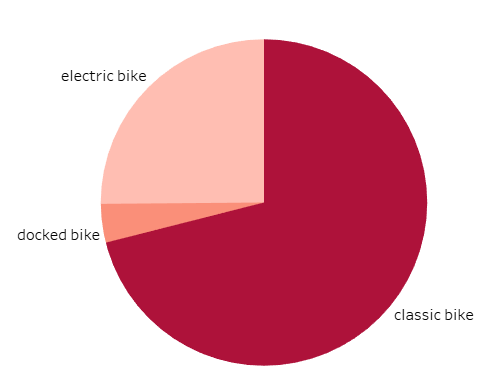

Example during a year:\
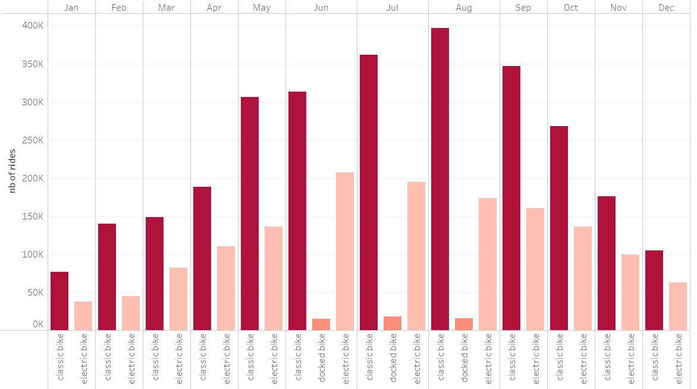

## Where do they use it the most?

Here are the top 10 stations used as a start and end for all
**members**.

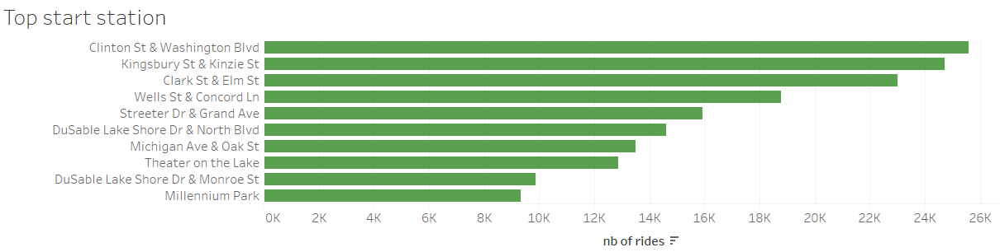\
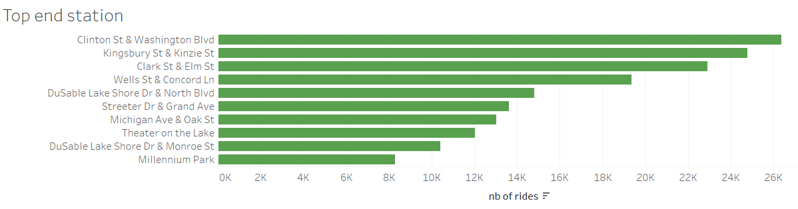 Here are the top 10 stations used as a start and
end for all **casual users**.\
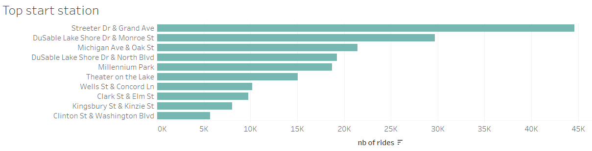\
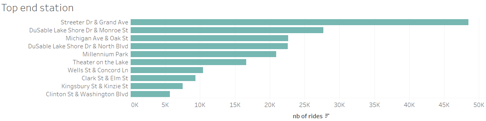

For each type of user, in both cases, we can find the same station as
the start and end of rides.\
Since I'mnot familiar with the names, I display the city maps for those
you may know.

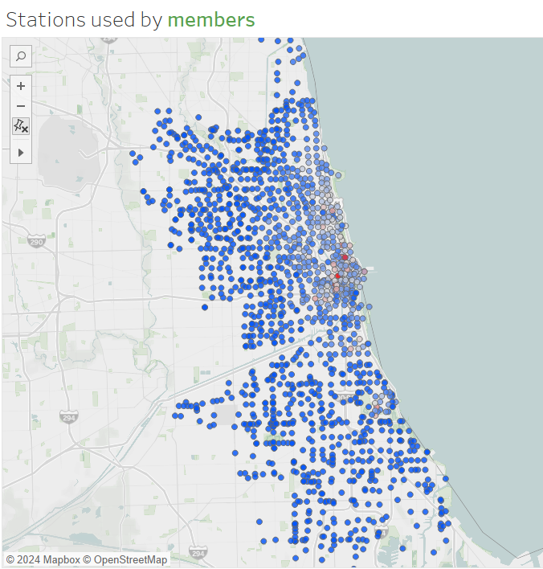

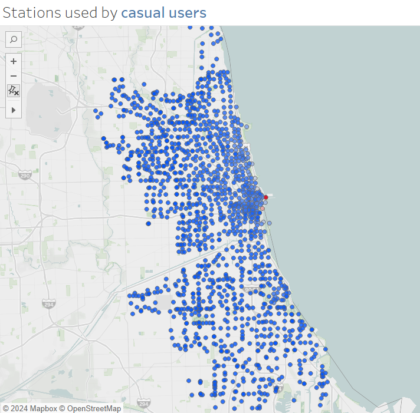

The most used stations are located on the waterfront, in the business
district, and in the tourist center.\
`r colorize("Casual",'#76B7B2')` users go to E Grand Ave & N Streeter Dr
which is the center of leisure activities.\
The most frequent route is scenic or it can be a round trip from and to
these stations:\
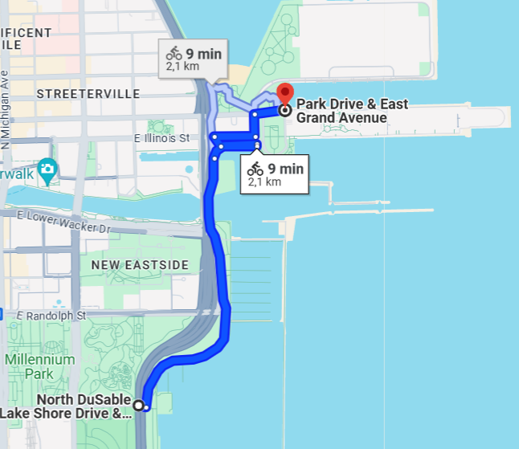

`r colorize("Members",'#59A14F')` use station in a large area with
buildings and several stations for different means of transport\
The most frequent route is this one: 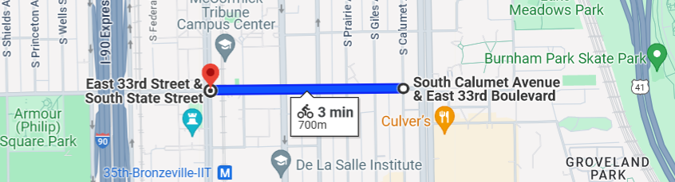

# Act

The analysis shows how annual members and casual riders use Cyclistic
bikes differently.\
To summarize the previous analysis in broad terms, members use bicycles
to commute, and or for pleasure during the weekend. It is the most
numerous users who travel on smaller journeys. Casual users are mostly
users who use bikes for tourism.They are fewer in number but use the
bikes longer.

We should focus on the casual users that could be members. A lot of
casual users are probably not interested in a membershing as they will
use the bikes occasionally for some days. However, some of them can be
locals that use bikes during the evening or during the weekend. We may
focus on them to become members.

Three main recommendations that we can make could be:

-   We could offer them **a new type of member account** for evenings
    and weekends with some advantages that should be between those who
    are members, the "premiums", and those who are casual users. For
    example, we should offer advantageous prices for their favorite
    routes during evening and weekend journeys.\
-   The marketing campaign should be carried out **during the spring and
    summer, or even until the beginning of autumn**, because this is
    when these users are circulating.\
-   The **application** should suggest the winnings won if they were
    passed to the member account. Displays should be made **around the
    stations most used** by casual users.
